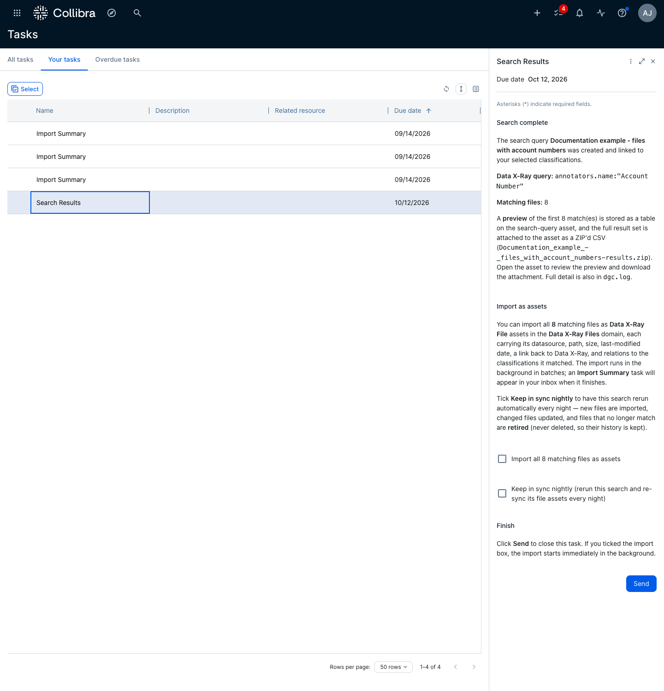
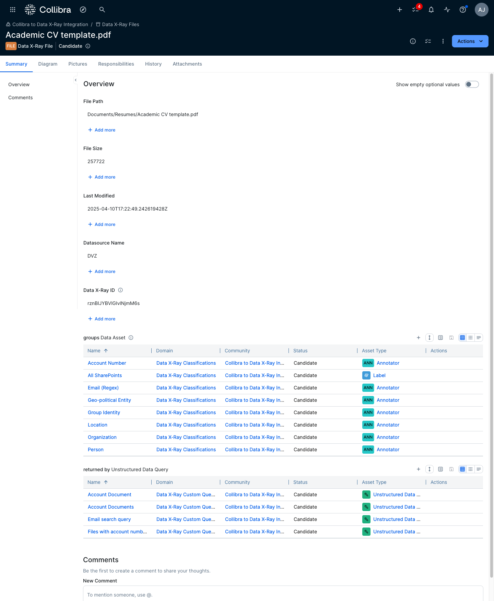
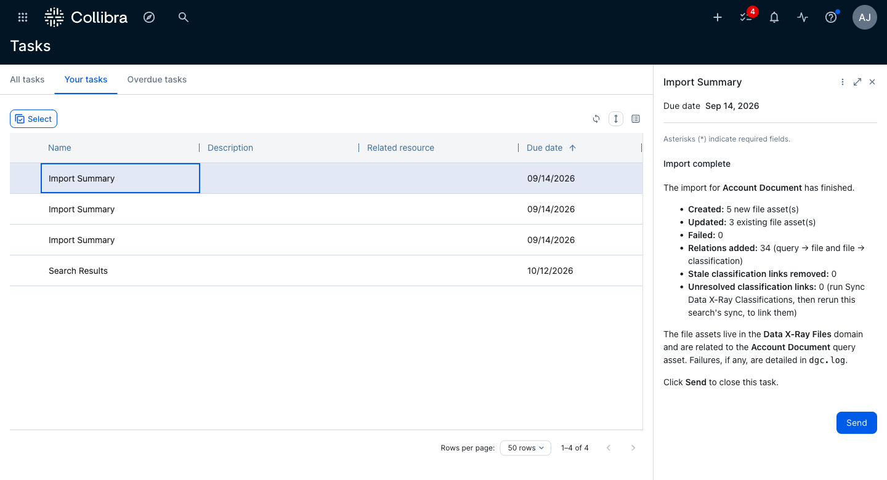
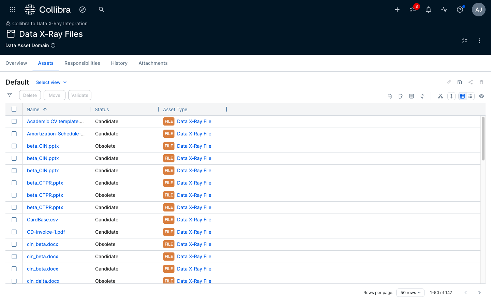
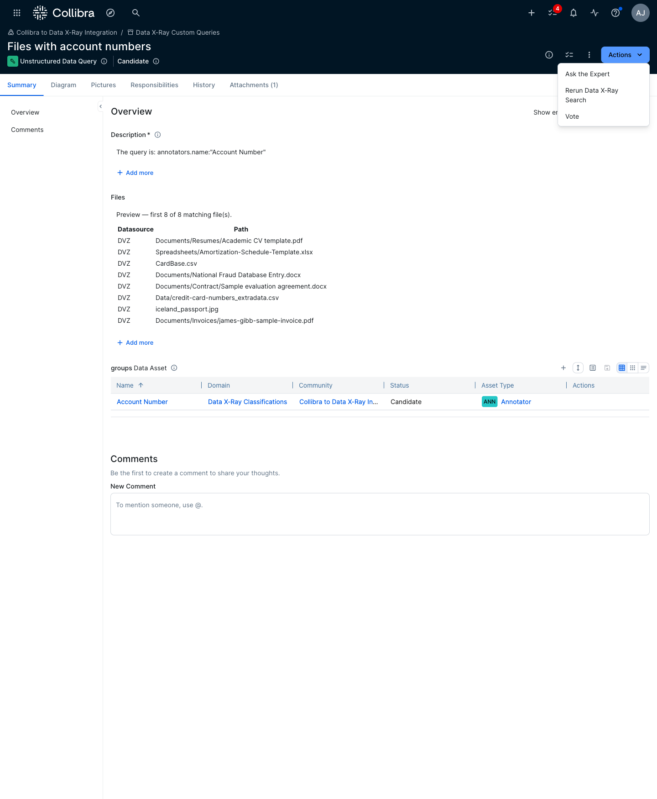
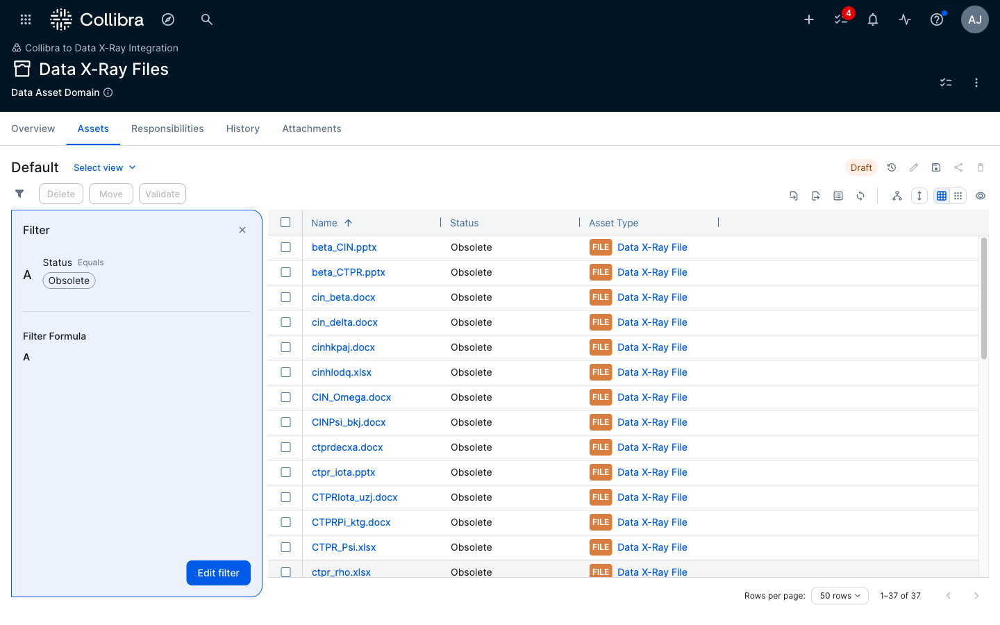

# Data X-Ray File Assets — Sync & Lifecycle

This document explains how the Data X-Ray workflows turn search results into
**Data X-Ray File** assets in Collibra and what happens to those assets over
time: how they are created, how many there can be, how they are kept in sync,
how they become orphaned and retired, and what — if anything — ever deletes
them. It is written for Collibra administrators and Data X-Ray Admins who
operate the integration; the companion [deployment guide](deployment-guide.md)
covers installation.

Terminology used throughout:

| Term | Meaning |
|---|---|
| **File asset** | An asset of type **Data X-Ray File** in the **Data X-Ray Files** domain. One per file in Data X-Ray. |
| **Query asset** | An asset of type **Unstructured Data Query** in the **Data X-Ray Custom Queries** domain. Created by **Search Data X-Ray**; one per saved search. |
| **Returns** | The relation from a query asset to each file asset its search currently matches (*query* **returns** *file* / *file* **returned by** *query*). This is the integration's record of "which searches this file belongs to". |
| **Retired** | Collibra status **Obsolete**. The asset and everything attached to it (attributes, relations, comments, attachments, history) is kept. |
| **Active** | Collibra status **Candidate** — the status every file asset is created with and reactivated to. |
| **Rerun** | A run of **Rerun Data X-Ray Search** for one query asset, started by a user from the asset's page or headlessly by **Sync Data X-Ray Files (Nightly)**. |

## The lifecycle at a glance

```
              Search Data X-Ray                       Rerun (manual or nightly)
   (import ticked on the results task)         (file still matches the query)
                     │                                          │
                     ▼                                          ▼
   ┌──────────────────────────────┐   rename/attributes/   ┌──────────────┐
   │ created — status Candidate   │ ───── relations ─────▶ │   updated    │
   │ linked: query ──returns──▶ file │       refreshed        │ (same asset) │
   └──────────────────────────────┘                        └──────────────┘
                     │                                          ▲
   file no longer matches this query (rerun)                    │
   or the query asset was deleted (nightly sweep)     file matches any query again
                     │                                  (rerun or new import)
                     ▼                                          │
   ┌──────────────────────────────┐                             │
   │ unlinked from that query     │                             │
   └──────────────────────────────┘                             │
                     │  no query returns it any more            │
                     ▼                                          │
   ┌──────────────────────────────┐   reactivated (Candidate)   │
   │ retired — status Obsolete    │ ────────────────────────────┘
   │ (kept, never deleted)        │
   └──────────────────────────────┘
                     │
                     ▼   only by a human — bulk delete in the Files domain
                  deleted
```

The one-sentence version: **the integration creates, updates and retires file
assets; it never deletes them.**

---

## How are file assets created?

File assets are only ever created by an **import** — either the one offered at
the end of **Search Data X-Ray**, or a **rerun** of a saved search that finds
files it did not have before. Running a search on its own creates **no** file
assets: the results are stored on the query asset (a preview table and an
attached CSV), and the results task then *offers* the import:



Ticking **Import all N matching files as assets** and clicking **Send** starts
the import in the background. Ticking **Keep in sync nightly** as well tags the
query asset `dataxray-keep-in-sync`, which is what the nightly file sync looks
for (see [How are file assets kept in sync?](#how-are-file-assets-kept-in-sync)).

What the import does, per matching file:

1. **Works out the asset's identity.** Every file asset's UUID is derived
   deterministically from the file's Data X-Ray file id. The same Data X-Ray
   file therefore always maps to the *same* Collibra asset, no matter which
   search imports it or how often. If the asset already exists it is updated
   in place; it is never duplicated.
2. **Creates the asset** (if it does not exist) in the **Data X-Ray Files**
   domain with type **Data X-Ray File** and status **Candidate**. The asset's
   *display name* is the clean filename (`invoice.pdf`); its *full name* is the
   filename plus a short suffix derived from the UUID (`invoice.pdf [e8cf757f]`),
   because Collibra requires names to be unique within a domain and filenames
   repeat constantly.
3. **Writes its attributes**: Data X-Ray ID, File Path, File Size, Last
   Modified and Datasource Name (and a Link, when Data X-Ray supplies one).
   These are overwritten on every sync, so they always reflect the last run.
4. **Links it to the query** with a *returns* relation — the record that this
   search currently matches this file.
5. **Links it to the classifications it matched** (labels, extractors and
   annotators, using Collibra's *groups / is grouped by* relation) — but only
   where the Data X-Ray result carries positive evidence: a label applied to
   the file, an extractor that produced metadata, an annotator with at least
   one hit. An annotator that was *checked* but found nothing is not a match
   and gets no relation. A classification that has not yet been synced into
   Collibra is skipped and counted as "unresolved" in the summary; run **Sync
   Data X-Ray Classifications** and rerun the search to link it.



The import runs as a background job in **batches of 50** files, each in its own
transaction, so a large import never holds one giant transaction and one
failing batch never stops the rest (it is logged and counted as failed). When
the job finishes an **Import Summary** task arrives in the inbox of the person
who ran the search:



The imported assets appear in the **Data X-Ray Files** domain:



---

## How is the maximum number of file assets controlled?

There is a single **instance-wide cap of 25,000 file assets** in the
**Data X-Ray Files** domain, with a **warning above 10,000** for any one import.
The cap exists to keep imports, nightly syncs and the Collibra instance itself
responsive; it is a fixed constant in the workflow scripts, not a setting that
can be changed in the Collibra UI (contact Ohalo if your deployment needs a
different limit).

Key facts about how it is applied:

- **It is a total, not a per-import limit.** Before every import or rerun the
  workflow counts *every* asset currently in the Data X-Ray Files domain and
  adds the number of new assets the run would create. If that projected total
  exceeds 25,000, the run is refused and nothing is imported.
- **Retired file assets count.** The count is of all assets in the domain
  regardless of status — a file asset retired to Obsolete still occupies one
  of the 25,000 slots until a human deletes it. See
  [What to do when you reach the limit](#what-to-do-when-you-reach-the-limit).
- **The projection is deliberately conservative.** For a new search, the
  projection is *current population + number of matching files* — even though
  some of those files may already exist from other searches (and would only be
  updated). For a rerun, files the query already returns are excluded (they
  are updates), but overlap with *other* queries' files is still counted as
  new. So the check can refuse slightly early; it never lets the domain go
  over.
- **It is enforced in the scripts, not just the form.** The results task hides
  the import controls when the cap would be exceeded, but the import job
  re-checks the projection when it starts, so the limit cannot be bypassed by
  completing the task through the REST API.

What you see when the cap is hit:

| Situation | Behaviour |
|---|---|
| A search's results task, and the projected total would exceed 25,000 | The import checkboxes are not shown. Instead the task shows: *"Importing is disabled for this search: the Data X-Ray Files domain holds N file asset(s) and this search matched M file(s) — the projected N+M would exceed the 25000 instance-wide limit. Narrow the query, or retire imported searches you no longer need."* |
| A search matched more than 10,000 files but is within the cap | Import is offered, with a *"Large import — expect it to run for a while in the background"* warning. |
| A **manual** rerun (from the query asset's page) would exceed the cap | The rerun stops immediately with an error naming the current population, the number of new files, and the projected total. Nothing is changed. |
| The **nightly** reruns a keep-in-sync query that would exceed the cap | The rerun is refused, logged in `dgc.log`, and ends cleanly. That query's file assets are left exactly as they were; other queries are unaffected. It will be refused again every night until the population is reduced or the query narrowed. |

---

## How are file assets kept in sync?

A file asset is a snapshot of what Data X-Ray reported the last time a search
that returns it was run. It is brought up to date by a **rerun** of any query
that returns it:

- **Manually** — open the **Unstructured Data Query** asset and start
  **Rerun Data X-Ray Search** from its **Actions** menu. A **Rerun complete**
  summary task reports what changed.
- **Automatically** — **Sync Data X-Ray Files (Nightly)** runs every night at
  **02:30** (server time), finds every query asset tagged
  `dataxray-keep-in-sync`, and starts one headless rerun per query. It runs
  after the 02:00 classification sync so renamed or removed classifications are
  already current when the queries are rebuilt.



A rerun rebuilds the search from the query asset's linked classifications (so
renames in Data X-Ray are picked up automatically), fetches the current
results, and then for each matching file:

| Change in Data X-Ray | Effect on the Collibra file asset |
|---|---|
| New file matches the search | A new file asset is created and linked (as in an import). |
| File renamed or moved (same Data X-Ray file id) | The **same** asset is renamed; File Path and the other attributes are refreshed. |
| Size / last-modified changed | Attributes refreshed. |
| A label was added, or an annotator/extractor now has hits | A *groups* relation to that classification is **added**. |
| A label was removed, or a classification no longer has hits on the file | The stale *groups* relation is **removed** — the asset mirrors exactly what Data X-Ray asserts. |
| The file was previously retired but matches again | The asset is **reactivated** (status back to Candidate), history intact. |
| The file no longer matches this search | See the next section. |

Controlling the nightly sync per query:

- **Pause**: retire the query asset (set its status to **Obsolete**). The
  nightly skips retired queries even if still tagged; its file assets are left
  as they are. Reactivate the query to resume. A manual rerun still works on a
  retired query.
- **Stop**: remove the `dataxray-keep-in-sync` tag from the query asset. Its
  file assets stay exactly as they are (they are still *returned* by the
  query, so nothing retires them).
- **Start**: add the tag to any query asset — including one whose search was
  originally imported without the nightly flag.

Because the integration mirrors the source system, Collibra reflects Data X-Ray
*as of the last sync*. Changes in Data X-Ray appear after Data X-Ray has
re-indexed and the next rerun has run — with nightly-only syncing that is up to
about a day; a manual rerun closes the gap immediately.

---

## How are file assets orphaned?

A file asset is **orphaned** when **no query returns it any more** — it has no
*returns* relation from any query asset. Orphaned file assets are **retired**
(status Obsolete). There are two ways this happens.

### 1. A rerun finds the file no longer matches

At the end of every rerun, the query's *previous* set of returned files is
compared with the *current* results:

1. Each file the query returned last time but not this time is **unlinked** —
   its *returns* relation from **this** query is removed.
2. The workflow then checks whether **any other** query still returns the
   file. If one does, the asset is left active: it is still a legitimate
   result of that other search. If none does, the asset is **retired**.

So a file returned by two searches is only retired once **both** stop
returning it. The summary task reports both numbers separately (*Unlinked* vs
*Retired*):

| Scenario | Outcome |
|---|---|
| File deleted in Data X-Ray | Disappears from every search's results → unlinked from each as they rerun → retired once the last one has rerun. |
| File changed so it no longer meets the criteria (e.g. a label removed) | Unlinked from that query; retired only if no other query returns it. |
| Search criteria narrowed (a criterion removed in Data X-Ray is *not* silently dropped — the rerun fails instead, see the deployment guide) | Files outside the new criteria are unlinked, then retired if orphaned. |
| Data X-Ray re-scanned a datasource and assigned **new file ids** | The new generation is created as new assets; the old generation becomes orphaned and is retired with its history intact. |

### 2. The query asset itself was deleted

Deleting an **Unstructured Data Query** asset in Collibra deletes its
*returns* relations with it. No rerun can ever retire the files it exclusively
returned, because the query that would have done so no longer exists. The
nightly file sync therefore ends every run with an **orphan sweep**: it lists
every file asset in the Data X-Ray Files domain that has **no** *returns*
relation from any query and retires those that are still active. Files other
queries also return are untouched.

The sweep only acts on a complete picture: if listing the relations or the
domain fails part-way, the sweep is skipped for that night and retried the next
(orphans wait one more night rather than risk retiring on partial data).

> Deleting a query also discards its attached results CSV and its history. If
> the aim is only to stop syncing, prefer removing the tag or retiring the
> query — see [How are file assets kept in sync?](#how-are-file-assets-kept-in-sync).

### Safety rails — when retirement is deliberately skipped

- **A rerun that returns zero results retires nothing.** An empty answer from
  Data X-Ray is far more likely to be an outage or truncated response than a
  search that genuinely matches nothing; retiring a query's whole population on
  that basis would be wrong. The result set is fetched with up to three
  attempts, and if all fail the rerun stops with an error and changes nothing.
- **An aborted rerun retires nothing.** If the run is refused (cap exceeded,
  connection not configured, a criterion deleted in Data X-Ray, started on the
  wrong asset type), the unlink/retire pass does not run.
- **Files already retired are left alone** by both the rerun and the sweep —
  their status and history are not touched again.

---

## How are file assets deleted?

**They are not — not by the integration.** No workflow in this bundle deletes
a file asset (or a classification asset, or a query asset). Every path that
removes a file from the picture ends in **Obsolete**, so comments, attachments,
history and the file's classification relations survive as a record.

Deletion is a **manual, administrative action**, done in the Collibra UI (or
via the REST API) by someone who holds a delete-capable responsibility on the
Data X-Ray Files domain or is a Sysadmin. Collibra's default permission model
means ordinary users cannot delete assets at all, and the deployment guide asks
you to keep it that way for the Files and Classifications domains — treat them
as sync-owned.

What to expect if file assets *are* deleted by hand:

| You delete… | Then… |
|---|---|
| A **retired** file asset | Nothing further happens. This is the safe, intended way to reclaim capacity (see below). If the file later matches a search again it is simply created afresh as a new asset (same UUID, but its old history is gone). |
| An **active** file asset that a search still matches | The next rerun of that search (manual or nightly) **recreates** it — same UUID, same name, fresh attributes and relations — because the deterministic identity means the workflow simply sees a file it has not imported yet. Its comments and history are not restored. |
| A **query asset** | Its file assets are **not** deleted. Those no other query returns are retired by the next nightly orphan sweep (see above). |
| A **classification asset** | Not recommended — see the acceptance criteria (CAT-10). File assets keep working, but saved searches that used it silently lose that criterion. |

---

## What to do when you reach the limit

You have reached the limit when a search's results task shows *"Importing is
disabled for this search…"*, a manual rerun stops with *"…would exceed the
25000 instance-wide limit"*, or `dgc.log` shows nightly reruns being refused
for the same reason. Because **retired assets still count**, freeing capacity
always ends with deleting retired file assets; the steps below get you there
safely.

### 1. See where the capacity is going

Open the **Data X-Ray Files** domain and group or filter the asset table by
**Status**. Two numbers matter: how many assets are **Obsolete** (retired —
reclaimable immediately) and how many are **Candidate** (active — each is still
returned by at least one search). Adding the **returned by** relation as a
column shows which searches account for the active ones.



### 2. Delete retired file assets

Retired assets are the integration's "done with this" signal; deleting them
loses only their history. In the Files domain, filter to **Status = Obsolete**,
select all, and use Collibra's bulk **Delete**. This is the *only* deletion the
integration expects, and the safest.

If you want to keep a record of the retired assets (for example for audit
purposes), export the filtered table to CSV before deleting. Do not move them
to another domain instead: the workflows track file assets by UUID, not by
domain, so a moved asset would be updated and reactivated *where it is* the
next time the file matches a search.

### 3. Retire the searches you no longer need

Active file assets can only be reclaimed by first making them orphans. For
each saved search whose files are no longer wanted:

1. Note which of its files are also returned by other searches (those will
   stay active, correctly).
2. **Delete the query asset**. Its *returns* relations go with it.
3. Wait for the nightly file sync (02:30) — its orphan sweep retires every file
   asset no remaining query returns. (An administrator can also start
   **Sync Data X-Ray Files (Nightly)** immediately via the REST API,
   `POST /rest/2.0/workflowInstances`, rather than waiting.)
4. Delete the newly retired assets as in step 2.

Merely removing the `dataxray-keep-in-sync` tag or retiring the query asset
does **not** free anything: its file assets remain *returned* by it and stay
active.

### 4. Narrow the searches you keep

For searches that are useful but broad, tighten the criteria (all criteria are
AND-ed, so adding a label, extractor or annotator only ever shrinks the result
set). Create the narrower search with **Search Data X-Ray**, import it, and
then delete the broad query asset as in step 3 — files matched by both are
reused by the new query and stay active; the rest are orphaned and retired.

### 5. If the limit itself is the problem

The 25,000 cap is a constant in the workflow scripts, chosen to keep imports
and nightly syncs within the volumes Collibra's workflow engine handles
comfortably. If your organisation's legitimate footprint is larger, contact
Ohalo — raising the limit is a change to the workflow bundle, after which you
re-import the updated workflows (an in-place update; no reconfiguration is
needed).

---

## Quick reference

| Question | Answer |
|---|---|
| What creates a file asset? | An import from a search's results task, or a rerun that finds a new match. Never a search on its own. |
| What is a file asset's identity? | Its Data X-Ray file id — the Collibra UUID is derived from it, so the same file is always the same asset. |
| Which domain / type? | **Data X-Ray Files** / **Data X-Ray File**, status **Candidate** when active. |
| Maximum number? | **25,000** in the domain in total, retired ones included; warning above **10,000** per import. Fixed in the scripts. |
| What keeps them current? | Manual **Rerun Data X-Ray Search** on the query asset, or the **02:30 nightly** for queries tagged `dataxray-keep-in-sync`. |
| When is one retired? | When no query returns it any more — after a rerun unlinks it, or after the nightly orphan sweep finds it with no *returns* relation (deleted query). |
| When is one deleted? | Only by a person. The integration never deletes. |
| When is a retired one reactivated? | As soon as any search's import or rerun matches it again. |
| How do I free capacity? | Delete retired assets; to retire active ones, delete their query asset and let the nightly sweep run, then delete. |
